[Retour à l'index](index.md)
# Chapitre 1: Introduction à Internet/Web
## 1- Internet
Une technologie conçue dans les années 1960 aux États-Unis. Elle a été imaginée par les 3 scientifiques: **J.C.RLicklider, R.Taylor et L.Roberts**, qui ont un jour déclaré: 
*[...] Nous pensons que nous entrons dans une ère technologique dans laquelle nous pourrons interagir avec la richesse des informations vivantes, non seulement de la manière passive avec laquelle nous nous sommes habitués à utiliser des livres et des bibliothèques, mais en tant que participants actifs dans un processus continu, en lui apportant quelque chose par notre interaction avec lui [...]*
<small>J.C.R. Licklider, Robert W. Taylor, 
“The Computer as a Communication Device”, in Science and Technology 76, pp 21-31, 1968.</small>

- Ils évoquent la limite des supports traditionnels, comme le papier.
- Ils annoncent une nouvelle ère, où la technologie transforme notre rapport à l'information.
- L’information ne sera plus figée comme dans un livre, mais vivante, dynamique, évolutive.
- Grâce à l’ordinateur, l’utilisateur devient acteur : - il commente, modifie, enrichit, contribue à la connaissance (comme sur Wikipédia, les réseaux sociaux, etc.).

Pour concrétiser cette vision, il fallait d'abord trouver un moyen de connecter plusieurs machines distantes : c’est ainsi qu’est né *Internet*.

**Internet**: un mot composé: Inter + Net = Réseaux interconnectés (réseau de réseaux)
"Inter" : préfixe signifiant "entre"
"Net" : abréviation de "network", c’est-à-dire "réseau"

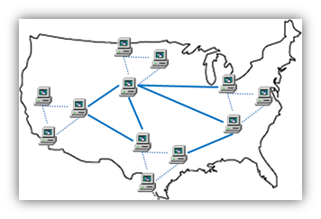

### Les inventions nécessaires:

- **Le modem:** Équipement capable d’envoyer des données numériques sur une ligne téléphonique (analogique)
- **La Commutation automatique (Switching):** Mécanisme permettant d’acheminer automatiquement un message vers sa destination, en choisissant un chemin parmi plusieurs possibles.
- **L’adressage IP:** Permet d’Identifier de manière unique une machine dans un réseau.
- **Le DNS:** Associe pour une ip un nom facile à retenir.

### Futur L’internet par satellite ?
Si les câbles sous-marins restent aujourd’hui la colonne vertébrale de l’Internet mondial, ils ont des limites physiques : longs à installer, coûteux, sensibles aux coupures.
Pour aller plus loin, une nouvelle évolution est apparue : l’Internet par satellite.
Historiquement, les satellites offraient un débit limité avec une latence élevée. Mais aujourd’hui, des projets comme Starlink (développé par SpaceX) révolutionnent ce domaine.
Starlink déploie des milliers de satellites en orbite basse, formant un maillage autour de la Terre. L’objectif est d’offrir une connexion rapide et mondiale, même dans les zones rurales, isolées ou sans infrastructures.

## 2- Web

### Le Web, une application d'Internet
Quand on parle d’Internet, on fait référence à l’infrastructure technique : le modem, les commutateurs (switches), l’adressage IP et le système DNS.

Le Web, quant à lui, est une invention plus récente, apparue en 1989. Lorsqu’on parle du Web, on pense aux sites web, au HTML, au protocole HTTP, aux navigateurs et aux liens hypertextes qui permettent de naviguer d’une page à une autre.

Le Web n’est qu’une des applications d’Internet, mais c’est lui qui a rendu les médias grand public attentifs à Internet. 
*D’autres applications: email, FTP, VoIP, IRC, P2P, Cloud, etc.*

### Web:
World Wide Web (WWW), ou la toile d’araignée (en français).
Inventé 1989, au CERN, par [Sir Tim Berners Lee](https://www.youtube.com/watch?v=PbCG_BeL5dY).

**Technologies de base utilisés:**

- HTML: pour structurer le contenu de la page web.
- HTTP: pour transférer des documents sur le Web
- URL: l'adresse unique utilisée pour localiser une ressource sur le Web

**Les élément de base du Web**

- Serveur Web HTTP
- Langage HTML
- Navigateur Web (client HTTP)
- URL
- Protocole HTTP

*Remarque: Contrairement au nom de domaine, l’URL désigne l’adresse complète d’une ressource précise sur ce site. Ex: wwww.usthb.dz/etudiants/inscription*

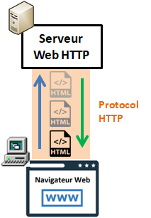

En 1989, Tim a rédigé un mémorandum détaillant l'idée de créer un système hypertexte distribué.

Cette proposition est donc devenue le point de départ de l’une des plus grandes révolutions technologiques de l’histoire moderne, car elle a permis de structurer et d’organiser l'accès à l'information de manière totalement nouvelle, offrant à la fois une utilisation mondiale et une facilité d’accès inédite.

Tim Berners-Lee a choisi de ne pas breveter ses inventions. Il a décidé que le code source du serveur web et du navigateur web serait ouvert et libre au grand public, sans en tirer aucun profit financier.
Il décide ensuite de fonder le **Web Consortium (W3C)** pour délivrer les standards d’un web ouvert et transparent.

### Web Sémantique:
Le [Web des données](https://www.youtube.com/watch?v=OM6XIICm_qo), après avoir été le web des documents.
Le Web de l’information vise à donner du sens aux informations pour que les machines puissent non seulement afficher des pages, mais aussi de comprendre et les relier les informations entre elles.

*Exemple:*
Si vous cherchez "Film de Robert De Niro"  sur un moteur de recherchez vous obtenez une liste de pages Web. Avec le Web sémantique, l’idée était que les machines comprennent la relation entre les données : De Niro > Heat > Heist films > Crime Films >…

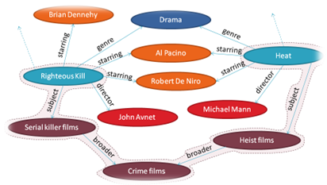

Cet exemple montre bien la différence entre un Web de documents (des pages isolées reliées par des liens) et un Web d’informations structurées (où les données elles-mêmes sont reliées et comprises par les machines).

### De nouveaux défis
La vision de Tim Berners Lee vision n’a pas été pleinement réalisée, car Internet a évolué vers un modèle dominé par des géants du numérique, qui centralisent les données dans de grands silos fermés (Google, Facebook, etc.).
Constatant cet écart avec l’esprit initial d’un Web libre et décentralisé, Tim travaille aujourd’hui sur un nouveau projet, [Solid](https://ruben.verborgh.org/blog/2017/12/20/paradigm-shifts-for-the-decentralized-web/), porté par sa société [Inrupt](https://www.inrupt.com/solid), afin de rendre aux utilisateurs la maîtrise et la propriété de leurs données personnelles, et de redonner au Web son rôle universel et ouvert.

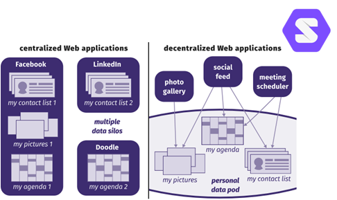

### 3- Pages/Sites Web
**Page Web:**

Une page Web peut contenir différents type d'éléments:
- Bannière avec Menu
- Des Titres
- Des boutons
- Des images
- Un slides d'images
- Un Tableau
- Des liens
- Du texte simple
etc.

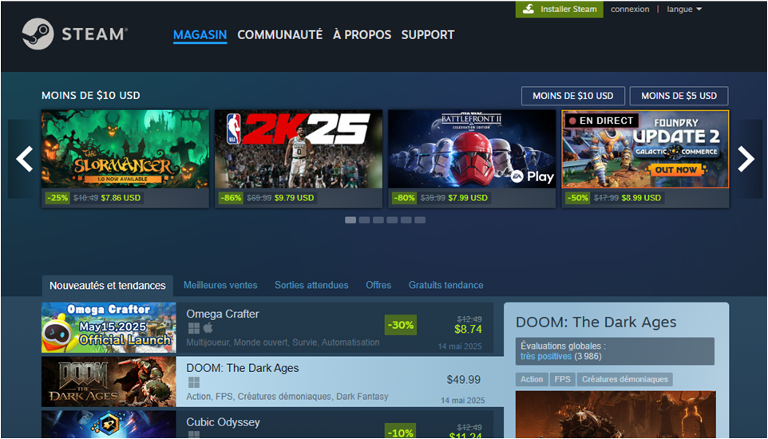

Les pages Web reposent sur les mêmes technologies de base, mais elles ont des apparences très différentes.
Cela dépend du:
- Contenu affiché: (texte, images, vidéos…).
- Style graphique appliqué:  (couleurs, polices, mise en page). 
- Des fonctions interactives intégrées: (menus, animations, formulaires…). 
- Du layout global (disposition) appliqué: (Multi-colonnes, en cartes,…). 

Une page Web peut être sobre et textuelle comme une encyclopédie en ligne, ou au contraire dynamique et visuellement riche comme un site de streaming. 
Chaque page reflète les choix du concepteur, en fonction du but du site, de son public cible et de son identité visuelle.

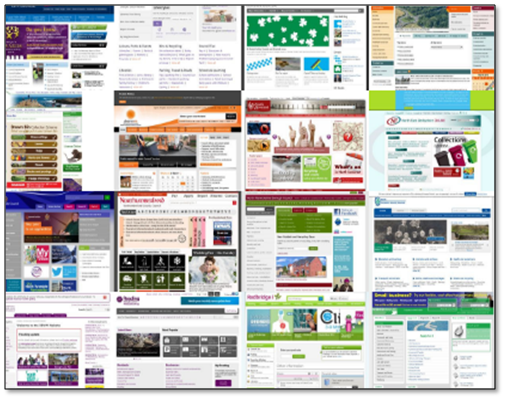

Ainsi, la conception d'une page web mobilise plusieurs compétences complémentaires, parmi lesquelles :
- Le design graphique: (esthétique, choix des couleurs, harmonie visuelle)
- L'ergonomie et l'expérience utilisateur (UX): (navigation fluide, accessibilité)
- La rédaction de contenu: (clarté, ton adapté, optimisé pour la recherche ‘SEO’)
- La stratégie de communication: (cohérence avec la marque, objectifs du site)
- Le développement web: (HTML, CSS, JavaScript,PHP…)

**Page vs Site Web**:

Un site web est un ensemble de pages Web stockées sur un ordinateur (serveur Web). Un site web est habituellement conçu autour d'une page centrale, appelée «page d'accueil» proposant des liens vers un ensemble d'autres pages hébergées sur le même serveur.…et parfois des liens dits «externes», c'est-à-dire de pages hébergées par un autre serveur.

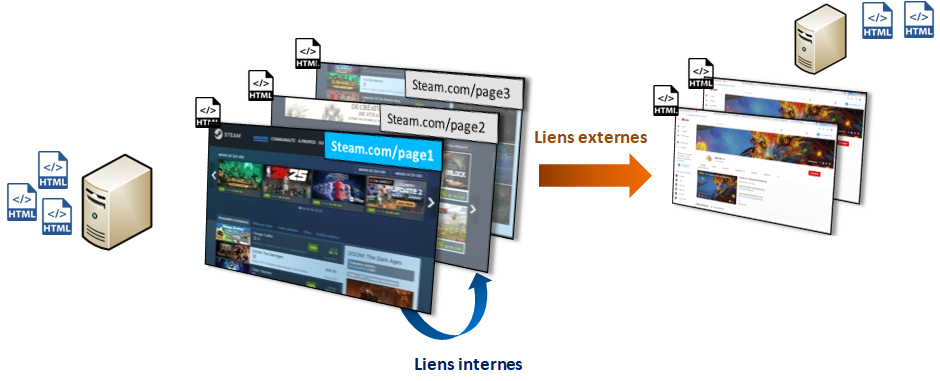

**Comment accéder à un site Web**
1- On ouvre un navigateur Web sur PC ou sur un Téléphone (client Web).
2- On saisit l'adresse du site Web auquel on veut accéder (ex: www.blender.org).
3- Résultat: Le site en question s’ouvre,(on obtient une page Web).

### 4- Les coulisses du Web
Quand vous dites "je vais sur un site Web", voici ce qui se passe en arrière plan :

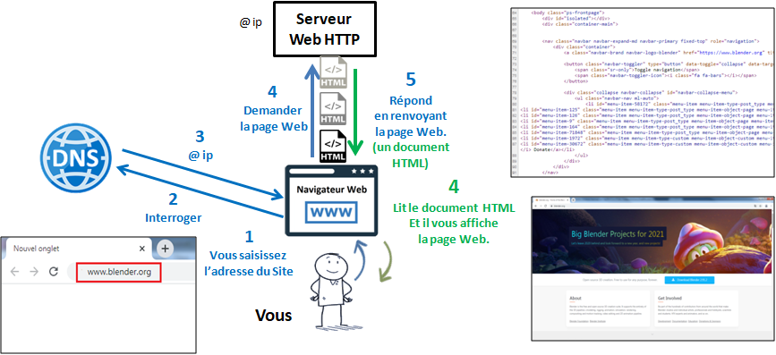

Donc Si vous voulez créer une page Web…Vous devez apprendre à écrire un document HTML.

**Est-ce que le HTML suffit à lui seul pour créer des page Web ?**

*Dans quel cas HTML suffit à lui seul?*
Le langage HTML pourrait suffire pour des page Web simples, de type rapport, qui ne nécessite pas de mise en forme. Il nous aidera à insérer des éléments de type:
- Paragraphes
- Titres
- Listes
- Tableaux
- Liens cliquables
etc.

*Dans quel cas HTML ne suffit pas à lui seul ?*
Le langage HTML ne suffira pas pour des page Web nécessitant une mise en page, pour appliquer des styles basiques ou avancés:
- Couleur de texte et de fond
- Police d’écriture
- Positionnement des éléments
- Espacement/marges
- Ombres
- Animations
etc.

Puisque le HTML ne suffit pas, que fait-on ? Nous aurons besoin d’un autre langage: Le CSS

**Langage CSS: Cascading Style Sheet**

Un document CSS (Cascading Style Sheet) ou (Feuille de Styles), est une document écrit en langage CSS, permettant de déclarer des styles.

Styles CSS:
- Couleur de texte et de fond
- Police d’écriture
- Positionnement des éléments
- Espacement/marges
- Ombres
- Animations
etc.

### 5- Langages et Technologies Web

Quels types de site pourrait-on créer avec HTML et CSS seulement ? 

**Sites Statiques:**

Les langage HTML et CSS suffisent pour créer des sites Web statiques :
- CV en ligne
- Site vitrine ou Portfolio (Galerie)
- Blog Statique
- Site de présentation d’un organisme
- Landing page (page de destination)
- Site de documentation technique
- Site événementiel
- Site de recette

**Interactivité coté client:**

Il arrive qu'on ait besoin de rajouter de l'interactivité côté client à une page Web. Ceci se fait avec JavaScript, en programmant des bouts de code qui seront exécutés du côté client (dans la navigateur)
Ex: réagir au clique de la souris, afficher/masquer des éléments.

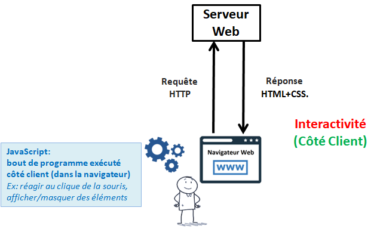

**Site Statique vs Site Dynamique**

D’abord, c’est statique ou dynamique pour qui ? (pour l’utilisateur ou pour le développeur ?
Réponse: Pour le développeur.
Exemple: Prenons l’exemple d’un site vitrine qui affiche la liste d’article mis en vente.

Dans un site **statique**, le développeur inscrit directement cette liste dans le code HTML : chaque nouvel article nécessite une modification manuelle du fichier.

Dans un site **dynamique**, le développeur écrit un programme qui va générer automatiquement le code HTML à partir d’une base de données : ainsi, l’ajout ou la suppression d’un article se fait sans toucher au code.

Les langages HTML et CSS seuls ne suffisent pas pour les sites dynamiques, car ceux-ci nécessitent des technologies capables de générer du contenu en fonction des utilisateurs ou du contexte.

Quelques use cases:
- Réseau social (profils utilisateurs, messagerie..)
- Site événementiel (inscriptions en ligne)
Blog avec commentaires
- Site d’actualités(articles publiés par différents auteurs)
- Plateforme e-commerce (catalogue produit, panier…)
- Application web (gestion de tâches, réservation, suivi en ligne)

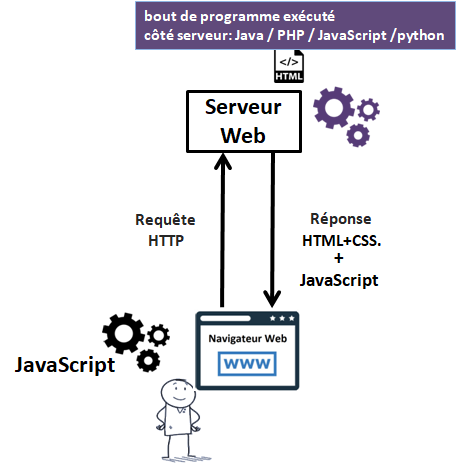

 
 

**Persistance des données**

On pourrait franchir une étape supplémentaire en ajoutant la persistance des données.
Dans l’exemple de la gestion d’articles, les articles ne sont plus stockés dans le code ou dans de simples fichiers, mais dans une base de données (comme MySQL ou PostgreSQL). Cela permet d’ajouter, modifier ou supprimer des articles via une interface (ex. panneau d’administration), et le site se met à jour automatiquement en affichant les données à jour.

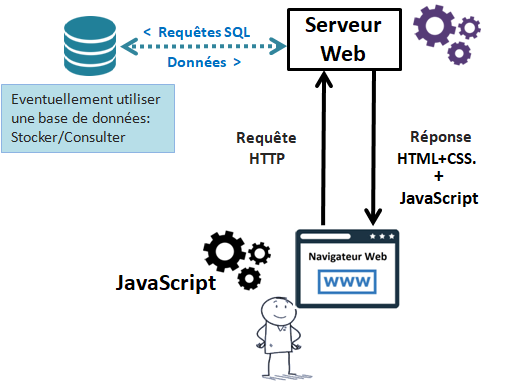

### 6- Et ChatGPT dans tout ça ?

ChatGPT nous aide, mais pas toujours.
Voici quelques inconvénients relatif au fait de se baser sur ChatGPT pour développer une application web  avec des "prompts" :

- Le développeur risque d’avoir une compréhension limitée du code généré.
- Dépendance à l’outil.
- Code parfois non fonctionnel ou incomplet (ChatGPT n’a pas une large vision sur tout votre code).
- Ambigüité dans les besoins exprimés
- Les bouts de codes fournis à des moment différents ne sont pas compatible (manque de persistance).
- Problèmes de maintenance à long terme (pour corriger une erreur, chatGPT doit connaitre tout votre code).
- Pour  un apprenant, il ne s’agit pas d’une bonne pratique (la dimension recherche est négligé).
