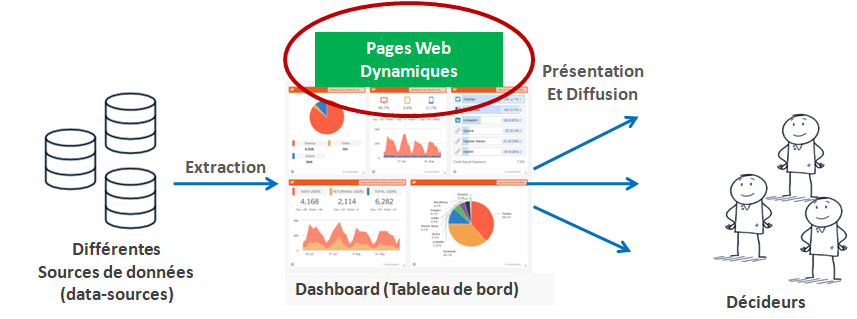

# Syllabus du Cours (PRAVAN)

**Université** : USTHB    
**Faculté / Département** : [Informatique / SIQ](https://finfo.usthb.dz/) 
**Niveau/Spécialité** : Master 2 / BIGDATA   
**Intitulé du cours** : Programmation Avancée (PRAVAN)  
**Année universitaire** : 2025-2026   
**Responsable du cours** : Dr. Mohamed Boubenia (MCB)  
**Laboratoire** : LSI (Bureau 224)  
📧 mo.boubenia@gmail.com / mboubenia@usthb.dz  
🌐 [Site personnel](https://sites.google.com/view/boubeniamohamed/accueil)  

## Master BigData ?
« …Le master vise la formation de compétences permettant d’assister les décideurs d’entreprise et d'organisations à la prise de décision…. Le parcours offre une formation ayant une double compétence en informatique et en aide à la décision valorisable dans le secteur professionnel socio-économique, comme il permet de poursuivre des études doctorales et de recherche…»

## Rôle de PRAVAN dans tout ça ?
Permet aux étudiants de se familiariser avec les nouvelles technologies du Web, notamment le langage Python, le Web multimédia et les Services web. 	

Crédits ECTS : [ex. 6 crédits]

  <a href="index.md" style="color:white; text-decoration:none;">
    ⬅️ Retour à l'index
  </a>

