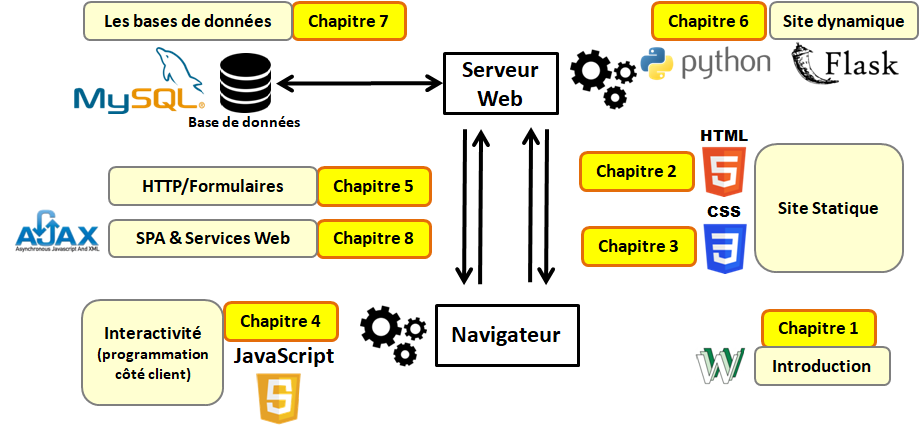

[Retour à l'index](index.md)
# Syllabus du Cours (PRAVAN)

**Université** : USTHB    
**Faculté / Département** : [Informatique / SIQ](https://finfo.usthb.dz/)  
**Niveau/Spécialité** : Master 2 / BIGDATA   
**Intitulé du cours** : Programmation Avancée (PRAVAN)  
**Année universitaire** : 2025-2026   
**Responsable du cours** : Dr. Mohamed Boubenia (MCB)  
**Laboratoire** : LSI (Bureau 224)  
📧 mo.boubenia@gmail.com / mboubenia@usthb.dz  
🌐 [Site personnel](https://sites.google.com/view/boubeniamohamed/accueil)  

## Master BigData ?
« …Le master vise la formation de compétences permettant d’assister les décideurs d’entreprise et d'organisations à la prise de décision…. Le parcours offre une formation ayant une double compétence en informatique et en aide à la décision valorisable dans le secteur professionnel socio-économique, comme il permet de poursuivre des études doctorales et de recherche…»

## Rôle de PRAVAN dans tout ça ?
Permet aux étudiants de se familiariser avec les nouvelles technologies du Web, notamment le langage Python, le Web multimédia et les Services web. 	

## Objectifs:	
Au terme de ce cours, l'étudiant devra être capable de concevoir **un site Web dynamique** avec des **fonctionnalités du côté client autant que du côté serveur**. Il devra aussi se familiariser avec les nouvelles technologies du Web, notamment le Web multimédia et les Services web **(Programmation Web Avancée)**.

## Contenu du cours:	
- Chapitre 1: Introduction à Internet/Web
- Chapitre 2: HTML
- Chapitre 3: CSS
- Chapitre 4: JavaScript
- Chapitre 5: HTTP/Formulaires
- Chapitre 6: Sites Dynamique (Python/Flask)
- Chapitre 7: Persistence des données
- Chapitre 8: SPA & Services Web

 

## Règlement:
- Travaux pratiques (TP) : à réaliser individuellement (monôme).
- Projet : à réaliser en binôme et à rendre à la date fixée.
- Cours magistraux : la présence n’est pas obligatoire.
- Travaux pratiques (TP) : la présence est obligatoire. Un retard de plus de 15 minutes sera considéré comme une absence.
- Les justificatifs d’absences doivent être validés par le département, et remis dans un délai de 48h, en version papier dans mon casier.
- Tout travail de plagiat/fraude/LLM sera sanctionné par un 0 dans le travail concerné.
- Les supports et annonces seront publiés sur Google Classroom.

## Evaluation:

Moyenne Générale  = TP×0.4 + EMD×0.6
Moyenne = CC + (Projet 1 × Coef1) + (Projet 2 × Coef2)
Crédit: 4
Coefficient: 4

